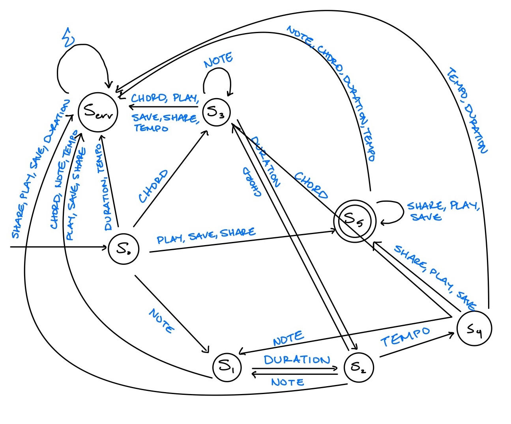

# MusicLang Lexical Grammar

## Overview
MusicLang is a programming language designed for composing music through code. This document outlines the lexical grammar defining the token types used in MusicLang.

## Installation Steps
Follow these steps to install Python and set up your environment:
### Install Python
1. **Download Python** <br>
Visit the [official Python website](https://www.python.org/downloads/) and download the latest version of Python.

2. **Run Installer** <br>
    - Open the downloaded installer file and follow the instructions.
    - Make sure to check the box that says "Add Python to PATH" before clicking "Install Now." This ensures that Python can be run from the command line.

3. **Verify Python Installation** <br>
- After the installation is complete, open a terminal or command prompt and run: <br>

      python --version
  You should see the version of Python you just installed (e.g., Python 3.13.0).


## How To Run
### 1. Clone repository
Clone this repository to local machine.
    
    git clone https://github.com/aditimutagi/PLT.git
    
### 2. Install Dependencies
Currently no dependencies, so no need to run the following command.

    pip install -r requirements.txt

### 3. Run Shell Script
Use the following command to run the shell script that will execute the Python program. Replace [input] with intended input.

    ./script.sh '[input]'
    
    ./script.sh 'chord (D3 C5) 0.75 A3 0.5 E5 1 150 play'

Make sure the shell script has execute permissions. If not, grant execute permissions using:

    chmod +x run_program.sh

Reference the following section for examples of valid tokens and sequences.

## Token Types

### 1. Note
- **Description**: Represents individual musical notes, which can be specified with their pitch and octave.
- **Examples**: 
    - C4 : Middle C
    - D#5 : D sharp in the fifth octave
    - E3 : E in the third octave
- **Pattern**: A-G(#[0-9]+|b[0-9]*)?[0-9]

### 2. Chord
- **Description**: Represents multiple notes played together simultaneously.
- **Examples**: 
    - chord (C4 D4) : C and D played together
    - chord (A3 C5 E5) : A, C, and E played simultaneously
- **Pattern**: chord (A-G(#[0-9]+|b[0-9]\*)?[0-9]+)(?: (A-G(#[0-9]+|b[0-9]*)?[0-9]+))+

### 3. Duration
- **Description**: Represents the length of time a note or chord is played, often specified in beats or fractions of a beat.
- **Examples**: 
    - 1.0 (one whole beat)
    - 0.5 (half a beat)
    - 0.75 (three-quarters of a beat)
- **Pattern**: (1|0\.[0-9]+|0?[1-9])
- **Special Rule**: If two "duration" tokens appear consecutively, the second one is interpreted as a "tempo" instead of a "duration." This allows specifying both the length of the previous note/chord and the tempo for the previous section.

### 4. Tempo
- **Description**: Represents the speed of the music, commonly defined in beats per minute (BPM). Tempo affects the overall pace of the composition.
- **Examples**: 
    - 1.5 (indicating the tempo for a section)
    - 120 (120 BPM)
    - 90 (90 BPM)
- **Pattern**: ([0-9]+(\.[0-9]+)?)
- **Special Rule**: A token is recognized as a "tempo" if it's identified as a "duration" and immediately follows another "duration" token. This rule distinguishes between the duration of a preceding note or chord and the tempo setting for the composition. The first duration specifies the length of the note or chord, while the second duration serves as the tempo indicator.

### 5. Play
- **Description**: Represents the action of playing a note or chord.
- **Examples**: play
- **Pattern**: play

### 6. Share
- **Description**: Represents the action of sharing a musical composition or code.
- **Examples**: share
- **Pattern**: share

### 7. Save
- **Description**: Represents saving the composition.
- **Examples**: save
- **Pattern**: save


## Valid Token Sequences
Note the following key valid token sequences:
- A note must be followed by a duration.
- A chord must be followed by a duration.
- Each sequence must terminate with a tempo.
- The sequence may include multiple notes and durations, but must always adhere to the following rules:
    - Valid sequences:
        - C4 0.5 D3 1 120
        - (C4 D3) 0.5 120
    - Invalid sequences:
        - C4 : ends on a note without a duration or tempo
        - C4 0.5 : doesn't define a tempo

## State Transitions
Note the following DFA diagram that illustrates the state transitions for this scanner:

- **S0 : START** Initial state before any tokens are read.
- **S1 : READING_NOTE** Read a valid note, expecting corresponding duration.
- **S2 : READING_DURATION** Read a duration. Can transition to **S1, S3, S4** based on subsequent token.
- **S3 : READING_CHORD** Read a valid chord, awaiting chord notes or duration.
- **S4 : ACCEPT** Valid sequence of tokens.
- **Serr: REJECT** Invalid sequence of tokens.





### Example State Transition 
Take the following working example : **chord (D3 C5) 0.75 A3 0.5 E5 1 150 play**

 1. START <br>
    State: **S0**
 2. Read the token: **chord** <br>
    State: **S3**
 3. Read the token: **(** <br>
    Expecting notes in the chord, so we stay in this state.
    State: **S3** 
 4. Read the token: **D3** <br>
    State: **S3**
 5. Read the token: **C5** <br>
    State: **S3**
 6. Read the token: **)** <br>
    Chord reading is complete; now expecting a duration.
    State: **S3**
 7. Read the token: **0.75** <br>
    State: **S2**
 8. Read the token: **A3** <br>
    State: **S1**
 9. Read the token: **0.5** <br>
    State: **S2**
 10. Read the token: **E5** <br> 
    State: **S1**
 11. Read the token: **1** <br>
    State: **S2**
 12. Read the token: **150** <br>
    State: **S4**
 13. Read the token: **play** <br>
     State: **S4** <br>

Scanner ends in the accepting state **S4** which means all tokens are valid, so input is **accepted**.

#### Sample Scanner Output:


## Grammar Definition 
```plaintext
Terminals: 
Note: A-G(#[0-9]+|b[0-9]*)?[0-9] 
Chord: chord 
Duration: (1|0.[0-9]+|0?[1-9]) 
Tempo: [0-9]+(.[0-9]+)? 
Play: play 
Share: share 
Save: save
()

Non-terminals:
Composition: Represents a complete musical composition, ending with a tempo.
Sequence: A series of musical elements, either notes or chords, each followed by a duration.
Element: A basic musical component, which can be a note or a chord.
NoteElement: A note followed by its duration.
ChordElement: A chord followed by its duration.
ChordNotes: A sequence of notes within a chord
PlayCommand: Optional command to start playing
Command: Optional actions after creating composition.
CommandAction: Possible actions to finalize composition (play, share, save)

Production Rules: 
S -> Composition Command
Composition -> Sequence Tempo | ε
Sequence -> Element Sequence | Element
Element -> NoteElement | ChordElement
NoteElement -> Note Duration
ChordElement -> Chord (ChordNotes) Duration
ChordNotes -> Note ChordNotes | Note
Command -> CommandAction Command | CommandAction
CommandAction -> Play | Share | Save
```


## AST Tree Mapping
```plaintext
S: 
  Composition: 
    Sequence: 
      Element: 
        NoteElement: 
          Note: C4
          Duration: 0.5
      Element: 
        NoteElement: 
          Note: D2
          Duration: 0.7
    Tempo: 120
  Command: 
    CommandAction: play
```


